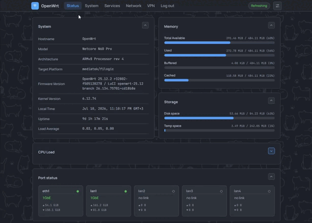

# luci-theme-footstrap

**English** · [Русский](README_ru.md)

> [!IMPORTANT]
> **Upgrading to 0.9.3 from 0.9.2 or earlier: upgrade from the console with the one-line command
> below — do not use the in-web *Update now* button.** In 0.9.3 the update machinery moved into a
> separate, optional package. The old in-web updater installs only the theme, which no longer carries
> that machinery, so it deletes its own backend mid-upgrade: *Update now* then fails with "resource
> not found" and no further updates are offered. Running the console command once installs both
> packages and restores updates. One-time step, for the 0.9.3 upgrade only.



[More screenshots →](docs/screenshots/)

A theme for LuCI, for OpenWrt 24.10 and newer.

It styles LuCI's standard components rather than individual pages, so third-party packages pick up
the look on their own — unless they bring their own styles. It adapts to any screen width, phones
included. Navigation runs as an SPA, which measures about 2.3× faster than luci-theme-bootstrap
(benchmark and comparison below). There are a few personalization settings. It is light, easy to
install and easy to update.

You can try the whole thing without installing anything, including changing the look through the
settings menu: **[the playground](https://vizzletf.github.io/luci-theme-footstrap/playground.html)**.

Feedback is welcome — [issues](https://github.com/VizzleTF/luci-theme-footstrap/issues) are open.

## What it does

**Styles apps, not just the stock pages.** The look hangs off generic rules for LuCI's widgets, so
third-party `luci-app` packages (podkop, statistics and the rest) come out looking like the system
screens without doing anything. An app that ships its own stylesheet keeps it.

**Works on a phone.** Tables — processes, DHCP leases, firewall rules — collapse into cards, forms
stack into one column, and the menu opens as a popup on tap. Nothing scrolls sideways.

**The look is a browser preference, not a router setting.** There is one theme entry to pick,
`Footstrap`. Everything else lives in the Appearance popover in the menu, applies instantly with no
reload, and writes nothing to the router:

- Layout — side menu or top bar
- Theme — auto (follows your OS), light or dark
- Palette — Footstrap (GitHub Primer colours) or Hi-Contrast
- Wallpaper — off, or cats; works with either palette
- Tint — washes one hue into the background, so you can tell which router a tab (or a screenshot in
  a ticket) belongs to
- Accent — re-hues buttons, toggles, sliders and focus rings
- Rounding — corner radius, 0–20px
- Submenus — keep several menu sections open, or auto-collapse to one

A set you like can be saved as the router-wide default, so a fresh browser starts from it.

**Faster than the stock theme.** Pages switch without a full reload. Measured over 38 pages against
luci-theme-bootstrap: the median page opens 3.4× faster and the whole run takes 2.3× less time.
Network requests per page drop from 15–48 to 0–8 — a page already in the cache fetches nothing. To
run the benchmark yourself, see [docs/15](docs/15-benchmark-navigatsiya.md) (Russian).

**It can update itself.** The router asks GitHub about new releases, not your browser, and
Appearance → *Update now* installs one. Turn the check off in the same popover if you would rather
it did not phone home.

## Install

One line over SSH. The script works out whether you have apk (25.12+) or opkg (24.10), downloads the
right package, verifies it and installs it:

```sh
wget -qO- https://raw.githubusercontent.com/VizzleTF/luci-theme-footstrap/main/install.sh | sh
```

For a specific version, pass the tag: `... | sh -s v0.9.0`.

It is one package — nothing else to install, and the translation catalogue travels inside it. The
theme ships a Russian catalogue; in other locales its own strings read in English, while the shared
chrome (Menu, Logout) follows whatever `luci-base` is translated into.

To install by hand, download the raw file from the
[releases](https://github.com/VizzleTF/luci-theme-footstrap/releases) — the file itself, not the zip
artifact from the Actions page:

```sh
apk add --allow-untrusted luci-theme-footstrap-*.apk   # 25.12+
opkg install luci-theme-footstrap_*.ipk                # 24.10
```

Then pick **Footstrap** in **System → System → Language and Style**, field "Design". That is the only
thing you set on the router.

### About that `--allow-untrusted`

It means apk and opkg hold no key of this project's — not that the bytes go unchecked. Verifying them
is the installer's own job, and it refuses rather than guessing:

- every download goes over a verified TLS channel (no `-k`, not even as a retry);
- the package is checked against an **ed25519 signature** made by a key that lives only in CI. This
  is the check that matters. A sha256 alone could not do it: GitHub *computes* the digest from
  whatever was uploaded, so anyone who could swap a release asset would get the digest recomputed for
  them, and it would verify their package. The same swap fails the signature;
- the sha256 GitHub publishes is checked too — it catches a truncated or tampered download from the
  asset CDN, which is a different host.

Signing started at v0.9.0, so releases up to v0.8.5 have no signature and the installer will refuse
them unless you pass `FOOTSTRAP_ALLOW_UNVERIFIED=1`. A signature that is present and *wrong* is never
overridable.

## Building a `luci-app`?

The [developer devkit](https://vizzletf.github.io/luci-theme-footstrap/) has the colour token grid,
the component markup and a style checker you can paste into.

There is also a written guide:
[how to style a LuCI app so it works under any theme](docs/20-luci-app-styling-guide.md) — CSS
lifetime, namespacing, the colour contract, dark-mode detection, and what this theme does when an app
breaks the rules. Drawn from 30 real apps and checked on a router.

## Licence

The theme is Apache-2.0, and that is not a free choice: `styles/base/` began as a fork of
[luci-theme-bootstrap](https://github.com/openwrt/luci)'s `cascade.css`, the ucode templates derive
from LuCI's own, and a few JS helpers are copied from LuCI verbatim. All of that is Apache-2.0, its
notices travel with it, and the LuCI/OpenWrt ecosystem is Apache-2.0 too.

The bundled webfonts are not covered by it. Manrope and JetBrains Mono are under the
[SIL Open Font License 1.1](luci-theme-footstrap/htdocs/luci-static/footstrap/fonts/OFL.txt), whose
text and notice ship beside the fonts, as that licence requires.

---

Internals, the build and development notes live in [docs/](docs/) (Russian).
