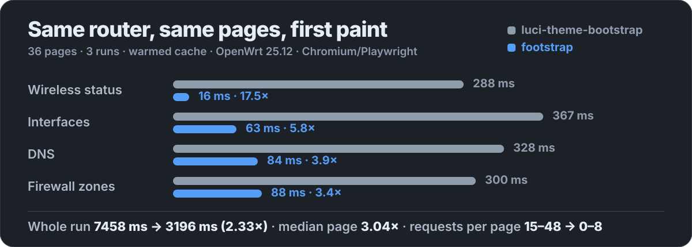

# LUCI-THEME-FOOTSTRAP

**English** · [Русский](README_ru.md) ·
**[Playground — try the whole thing with no router](https://vizzletf.github.io/luci-theme-footstrap/playground.html)**


[More screenshots →](docs/screenshots/)

## What it does

<br clear="left">

<picture>
  <source media="(prefers-color-scheme: dark)" srcset="assets/readme/appearance-dark.png">
  
</picture>

### Styles apps, not just the stock pages.

### Works on a phone.

### Light.

### Faster than bootstrap

### It can update itself.

### Have own appearence.


You pick **Footstrap** once in **System → System → Language and Style**. Every axis on the right is a
*client* preference: it applies instantly, with no reload.

- **Layout** — side menu or top bar
- **Theme** — auto (follows your OS), light or dark
- **Palette** — Footstrap (GitHub Primer colours) or Hi-Contrast
- **Density** — compact, normal or large
- **Wallpaper** — off, cats, or an image you upload
- **Tint** — washes one hue into the background, so you can tell which router a tab (or a screenshot
  in a ticket) belongs to
- **Accent** — re-hues buttons, toggles, sliders and focus rings
- **Rounding** — corner radius, 0–20px
- **Submenus** — keep several sections open, or auto-collapse to one

A set you like can be saved as the router-wide default, so a fresh browser starts from it.
<br clear="right">


## Measured, not claimed

<br clear="right">


<br clear="right">

## Install

<br clear="right">

```sh
wget -qO- https://github.com/VizzleTF/luci-theme-footstrap/releases/latest/download/install.sh | sh
```

Then pick **Footstrap** in **System → System → Language and Style**, field "Design". That is the only
thing you set on the router. For a specific version, pass the tag: `... | sh -s v0.9.0`.

The URL is the **release asset**, not `raw.githubusercontent.com`. GitHub rate-limits raw for
unauthenticated callers — 60 requests per hour per source IP — and behind CGNAT or a shared exit that
budget is often already spent by somebody else, so the raw URL can fail to deliver the installer
itself. Release assets carry no such budget. The raw URL still works if you prefer it:
`wget -qO- https://raw.githubusercontent.com/VizzleTF/luci-theme-footstrap/main/install.sh | sh`.

Nothing in the install or update path touches `api.github.com` any more. Both read a **signed
manifest** published with each release, so the 60-per-hour budget cannot break an install or a
version check (issue #17).

### If it will not download

If the router cannot reach `github.com` at all, retry through a GitHub proxy:

```sh
GITHUB_PROXY=https://gh-proxy.com/ sh -c "$(wget -qO- https://gh-proxy.com/https://github.com/VizzleTF/luci-theme-footstrap/releases/latest/download/install.sh)"
```

Public proxies that worked when this was written — none of them is ours, and any of them can go
away: `https://gh-proxy.com/`, `https://ghproxy.net/`, `https://ghfast.top/`, `https://gh.llkk.cc/`.

`GITHUB_PROXY` prefixes github URLs only, is tried first and falls back to the direct route, so a
dead proxy does not take the install with it. **The packages it delivers are safe whatever the proxy
does** — every one is checked against the sha256 in the signed manifest, so a proxy can serve the
real release or fail, never something else.

**The installer itself is the exception, and it is worth ten seconds of your attention.** The
one-liner above pipes a script fetched through a third party straight into `sh` as root, and no
signature has been checked at that point — the trust chain only starts once the script runs. If you
would rather not take that on faith, verify it first (`usign` is on every OpenWrt image):

```sh
P=https://gh-proxy.com/https://github.com/VizzleTF/luci-theme-footstrap/releases/latest/download
wget -qO /tmp/install.sh "$P/install.sh" && wget -qO /tmp/install.sh.sig "$P/install.sh.sig"
cat > /tmp/release.pub <<'EOF'
untrusted comment: luci-theme-footstrap release key
RWQYxjhl4rz41tNZc3dXmnRplRO1ydN1q8as++iPUjZc6SRUCb952L/T
EOF
usign -V -m /tmp/install.sh -x /tmp/install.sh.sig -p /tmp/release.pub && GITHUB_PROXY=https://gh-proxy.com/ sh /tmp/install.sh
```

The key is typed out above on purpose: compare those characters with
[`release.pub`](release.pub) in this repository and the proxy is cut out of the decision entirely.

There is also an automatic fallback that needs no proxy and no decision: if `github.com` does not
answer, the installer tries a **mirror on GitHub Pages** carrying the same signed manifest and the
same packages. A proxy is the thing to reach for when that host is unreachable too.

<br clear="right">

## Building a luci-app?

<br clear="right">


The [developer devkit](https://vizzletf.github.io/luci-theme-footstrap/) has the colour token grid,
the component markup and a style checker you can paste into.

There is also a written guide:
[how to style a LuCI app so it works under any theme](docs/20-luci-app-styling-guide.md) — CSS
lifetime, namespacing, the colour contract, dark-mode detection, and what this theme does when an app
breaks the rules. Drawn from 30 real apps and checked on a router.
