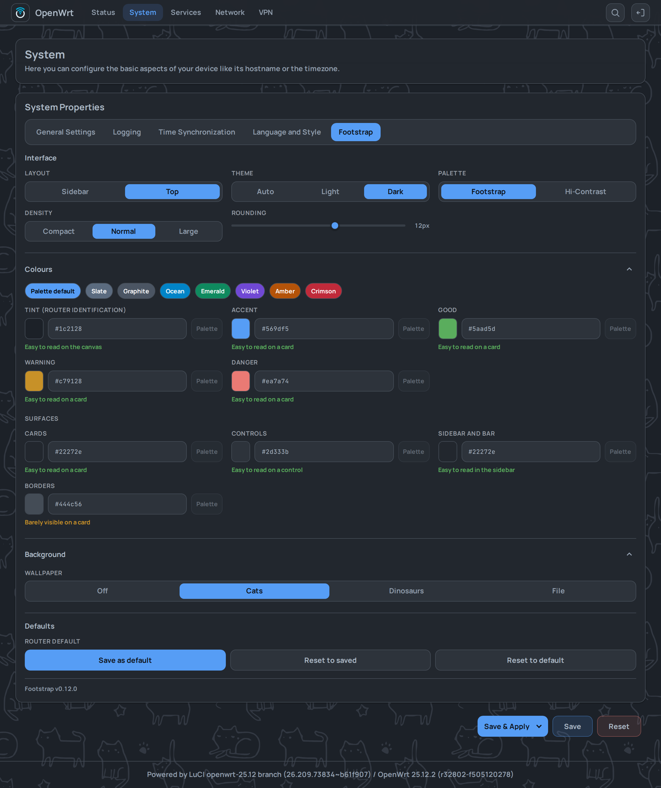

# LUCI-THEME-FOOTSTRAP

**English** · [Русский](README_ru.md) ·
**[Playground — try the whole thing with no router](https://vizzletf.github.io/luci-theme-footstrap/playground.html)**

[](https://owfeed.org/install/)
[](https://owfeed.org/install/)

<picture>
  <source media="(max-width: 767px)" srcset="assets/readme/phone-menu-dark.png">
  
</picture>

[More screenshots →](docs/screenshots/)

## What it does



- **Styles apps, not just the stock pages**
- **Works on a phone**
- **Light** — no framework, `luci-base` is the only dependency
- **Faster than bootstrap** — see the numbers below
- **Upgrades with the router** — installed from the package feed, so `apk upgrade` carries it
- **Appearance is yours** — eighteen axes, applied instantly, in one tab

You pick **Footstrap** once in **System → System → Language and Style**, and everything below lives
in the **Footstrap** tab on that same page. Every axis is a *client* preference: it applies
instantly, with no reload.

- **Layout** — top bar (the default) or the side menu
- **Theme** — auto (follows your OS), light or dark
- **Palette** — Footstrap (GitHub Primer colours) or Hi-Contrast
- **Density** — compact, normal or large
- **Wallpaper** — off, cats, dinosaurs (downloaded on demand, not shipped) or an image you upload
- **Tint** — washes one hue into the background, so you can tell which router a tab (or a screenshot
  in a ticket) belongs to
- **Colours** — accent and the three status colours, each a hex you type, with the ink over it
  derived from its lightness and the contrast it lands at reported in words
- **Surfaces** — cards, controls, the sidebar and the hairlines, same field
- **Rounding** — corner radius, 0–20px
- **Submenus** — keep several sections open, or auto-collapse to one

A set you like can be saved as the router-wide default, so a fresh browser starts from it.


## Measured, not claimed

Time to first paint, same router, same pages.

| Page | bootstrap | footstrap |
|---|---:|---:|
| Wireless | 288 ms | **16 ms** |
| Interfaces | 367 ms | **63 ms** |
| DNS | 328 ms | **84 ms** |
| Firewall | 300 ms | **88 ms** |
| 36-page run | 7458 ms | **3196 ms** |
| Requests/page | 15–48 | **0–8** |

Median page **3.04× faster**, the whole run **2.33×**.

<details>
<summary>The same numbers as a chart</summary>


</details>

## Install

### One line — the installer adds the feed for you

```sh
wget -qO- https://github.com/VizzleTF/luci-theme-footstrap/releases/latest/download/install.sh | sh
```

It detects the release line and the architecture, adds the
[owfeed-packages](https://github.com/owfeed/owfeed-packages) repository with its signing key,
protects both from being wiped by a firmware upgrade, and then installs through `apk` / `opkg`.
That last part is the point: the package manager knows where the theme came from, so **`apk upgrade`
carries it forward** like anything else. A downloaded file would sit at its version until somebody
came back with another file.

It asks once whether to add the optional update checker
(`FOOTSTRAP_UPDATER=1` / `=0` answers it non-interactively).

If the feed cannot be reached — or you pin a version, `... | sh -s v0.9.0`, which the feed cannot
serve because it carries one version per branch — the installer falls back to a release asset and
verifies it against a signed manifest. Both paths are described below.

Adding any feed means trusting it for *every* package name it can serve; the trade is spelled out in
[the feed's own install section](https://github.com/owfeed/owfeed-packages#install), and it is worth
the two minutes.

### By hand, if you would rather see every step

```sh
# OpenWrt 25.12 and later. HTTPS on a stock image needs these two first.
apk add ca-bundle libustream-mbedtls

wget https://repo.owfeed.org/owfeed-packages.pem -O /etc/apk/keys/owfeed-packages.pem
echo "https://repo.owfeed.org/releases/25.12/$(cat /etc/apk/arch)/packages.adb" > /etc/apk/repositories.d/owfeed-packages.list

# Keep the key and the repository across a firmware upgrade.
mkdir -p /lib/upgrade/keep.d
printf '%s\n' /etc/apk/keys/owfeed-packages.pem /etc/apk/repositories.d/owfeed-packages.list > /lib/upgrade/keep.d/owfeed-packages

apk update && apk add luci-theme-footstrap
```

On 24.10 and earlier the feed serves the same theme as an ipk, through opkg:

```sh
# The key file's NAME is its id — opkg looks it up by that.
wget https://repo.owfeed.org/9040356b214084da -O /etc/opkg/keys/9040356b214084da

echo "src/gz owfeed-packages https://repo.owfeed.org/releases/24.10/$(. /etc/openwrt_release; echo $DISTRIB_ARCH)" >> /etc/opkg/customfeeds.conf

opkg update && opkg install luci-theme-footstrap
```

Whichever way the feed gets added, do not *also* install a downloaded package on the same router:
`apk add ./file.apk` writes a content-hash pin into `/etc/apk/world` that survives sysupgrade, and
the package would never upgrade from the feed again.

### The installer's fallback — a pinned version, or no feed

The same one-liner takes this path automatically when the feed is unreachable or a tag is pinned:

```sh
wget -qO- https://github.com/VizzleTF/luci-theme-footstrap/releases/latest/download/install.sh | sh -s v0.9.0
```

It resolves the release from a signed manifest, checks that signature against a key baked into the
installer and the package's sha256 against the manifest, and installs the file. Nothing but the
release assets is needed — which is the case it exists for.

### Then

Pick **Footstrap** in **System → System → Language and Style**, field "Design". That is the only
thing you set on the router — everything else lives one tab along, under **Footstrap** on the same
page, and belongs to your browser rather than to the router.

<details>
<summary>Why that URL and not <code>raw.githubusercontent.com</code></summary>

The URL is the **release asset**. GitHub rate-limits raw for unauthenticated callers — 60 requests
per hour per source IP — and behind CGNAT or a shared exit that budget is often already spent by
somebody else, so the raw URL can fail to deliver the installer itself. Release assets carry no such
budget. The raw URL still works if you prefer it:

```sh
wget -qO- https://raw.githubusercontent.com/VizzleTF/luci-theme-footstrap/main/install.sh | sh
```

Nothing in the install or update path touches `api.github.com` any more. Both read a **signed
manifest** published with each release, so the 60-per-hour budget cannot break an install or a
version check (issue #17).

</details>

<details>
<summary>If it will not download</summary>

If the router cannot reach `github.com` at all, the **mirror** carries the installer too — same host
as the packages it will fetch, and it is ours:

```sh
wget -qO- https://vizzletf.github.io/luci-theme-footstrap/install.sh | sh
```

If that host is unreachable as well, retry through a GitHub proxy:

```sh
GITHUB_PROXY=https://gh-proxy.com/ sh -c "$(wget -qO- https://gh-proxy.com/https://github.com/VizzleTF/luci-theme-footstrap/releases/latest/download/install.sh)"
```

Public proxies that worked when this was written — none of them is ours, and any of them can go
away: `https://gh-proxy.com/`, `https://ghproxy.net/`, `https://ghfast.top/`, `https://gh.llkk.cc/`.

`GITHUB_PROXY` prefixes github URLs only, is tried first and falls back to the direct route, so a
dead proxy does not take the install with it. **The packages it delivers are safe whatever the proxy
does** — every one is checked against the sha256 in the signed manifest, so a proxy can serve the
real release or fail, never something else.

There is also an automatic fallback that needs no proxy and no decision: if `github.com` does not
answer, the installer tries a **mirror on GitHub Pages** carrying the same signed manifest and the
same packages. A proxy is the thing to reach for when that host is unreachable too.

</details>

<details>
<summary>Verify the installer before running it</summary>

**The installer itself is the exception, and it is worth ten seconds of your attention.** The
one-liner above pipes a script fetched through a third party straight into `sh` as root, and no
signature has been checked at that point — the trust chain only starts once the script runs. If you
would rather not take that on faith, verify it first (`usign` is on every OpenWrt image):

```sh
P=https://gh-proxy.com/https://github.com/VizzleTF/luci-theme-footstrap/releases/latest/download
wget -qO /tmp/install.sh "$P/install.sh" && wget -qO /tmp/install.sh.sig "$P/install.sh.sig"
cat > /tmp/release.pub <<'EOF'
untrusted comment: luci-theme-footstrap release key
RWQYxjhl4rz41tNZc3dXmnRplRO1ydN1q8as++iPUjZc6SRUCb952L/T
EOF
usign -V -m /tmp/install.sh -x /tmp/install.sh.sig -p /tmp/release.pub && GITHUB_PROXY=https://gh-proxy.com/ sh /tmp/install.sh
```

The key is typed out above on purpose: compare those characters with
[`release.pub`](release.pub) in this repository and the proxy is cut out of the decision entirely.

</details>

## Dev routers

Four of them — OpenWrt and ImmortalWrt, 25.12 and 24.10 — from one file, on any
OS. Needs [owlab](https://github.com/owfeed/owlab) and Docker:

```sh
go install owfeed.org/owlab/cmd/owlab@latest
owlab up                 # build and start all four
owlab sync --watch       # rebuild the CSS and push it on every edit
owlab open owrt2512      # open LuCI in a browser
```

Log in as `root` with an empty password. Details and the reasoning are in
[docs/development.md](docs/development.md).

owlab also builds the real package — `owlab build` runs the OpenWrt SDK and writes
`dist/<arch>/`, which [owfeed](https://github.com/owfeed/owfeed) signs and publishes without
either tool depending on the other. This theme is the worked example of that whole path;
[ECOSYSTEM.md](https://github.com/owfeed/owfeed/blob/main/docs/ECOSYSTEM.md) is the map.

## Building a luci-app?

The [developer devkit](https://vizzletf.github.io/luci-theme-footstrap/) has the colour token grid,
the component markup and a style checker you can paste into.

There is also a written guide:
[how to style a LuCI app so it works under any theme](docs/luci-app-styling-guide.md) — CSS
lifetime, namespacing, the colour contract, dark-mode detection, and what this theme does when an app
breaks the rules. Drawn from 30 real apps and checked on a router.

## Documentation

Developer documentation lives in **[docs/](docs/README.md)** — architecture, the design system, the
stylesheet build, the SPA router, packaging and the release runbook. Start with
[docs/architecture.md](docs/architecture.md) for what the theme is, or
[docs/conventions.md](docs/conventions.md) for the rules a patch has to follow.
